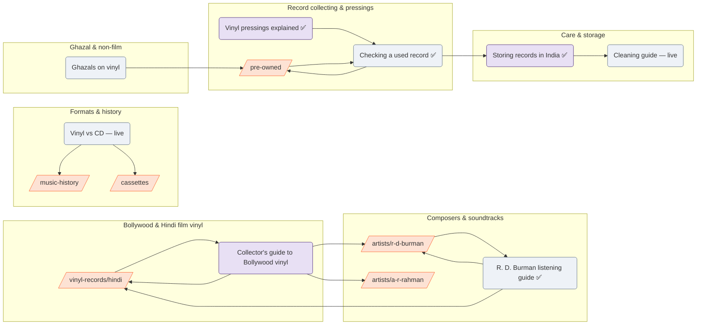

# Topical clusters and Journal roadmap — velorexmusic.com

The content plan, built from what Velorex actually sells (116 products at the
September 2026 audit: 112 vinyl, 4 cassettes; 104 Hindi-language; 10 pre-owned;
R. D. Burman 25 records, A. R. Rahman 11). A topic is here only if the shelf can
back it up — no cluster is built around stock the shop does not have.

Clusters connect three kinds of page:

- **Commercial pillars** — collection and composer pages that sell
  (`/vinyl-records/hindi`, `/artists/r-d-burman`, `/pre-owned`, …).
- **Editorial pillars** — one long, evergreen Journal guide per cluster.
- **Supporting articles** — narrower Journal pieces that link up to both.

Links between them are made by the editor's tags in **Admin → Blog** ("Related
collections", "Records in this article"), which the site turns into links in
both directions (CLAUDE.md §44), plus hand-written links inside each article.

---

## Map

Rectangles-with-slashes are commercial pages; rounded boxes are Journal
articles. ✅ = written in this repository (`content/journal/`), ready to import as
a draft. "live" = already published.

---

## Cluster 1 — Bollywood & Hindi film soundtracks on vinyl

The shop's core: 104 of 116 products are Hindi-language, 72 carry the genre
"Bollywood".

| | |
|---|---|
| **Commercial pillar** | `/vinyl-records/hindi` (with `/vinyl-records` as its parent) |
| **Editorial pillar** | *A Collector's Guide to Bollywood Vinyl Records* (roadmap #5) |
| **Supporting** | Decade guides (#9, #13), Saregama reissues (#10), budget collection (#17), gifting (#16) |
| **Artists** | R. D. Burman, A. R. Rahman (pages); Nadeem–Shravan, Anu Malik, Laxmikant–Pyarelal, Khayyam, Naushad (in articles) |
| **Products** | Sholay, Mughal-E-Azam, Umrao Jaan, Hare Rama Hare Krishna, Saagar, Dil To Pagal Hai, Baazigar, Border |

## Cluster 2 — Composers & soundtracks

| | |
|---|---|
| **Commercial pillars** | `/artists/r-d-burman` (25 records), `/artists/a-r-rahman` (11) |
| **Editorial pillar** | *R. D. Burman on Vinyl: A Listener's Guide* ✅ |
| **Supporting** | A. R. Rahman on vinyl (#6), Nadeem–Shravan and 1990s scores (#13) |
| **Candidates for a future composer page** | None yet: Anu Malik shows 8 records but one is test data (see PRODUCT-CONTENT-PRIORITY.md), leaving 7; Nadeem–Shravan has 6. A page needs 8 real records and written context. |

## Cluster 3 — Record collecting & pressings

Supported by real stock: 6 "1st edition" titles, 5 "2nd/3rd edition", 6 2LP
sets, 9 coloured/splatter/transparent/picture discs, 2 × 180g, a 10-inch, and 10
pre-owned records.

| | |
|---|---|
| **Commercial pillar** | `/pre-owned` |
| **Editorial pillar** | *Vinyl Pressings Explained* ✅ |
| **Supporting** | *Checking a Used Record Before You Buy* ✅, grading terms (#8), reading a sleeve (#15), 2LP sets (#14) |
| **Products** | Devdas 2LP 1st ed., Shraddhanjali 2LP 1st ed., Saher 1st ed. yellow, Rocky 1st/2nd ed., Dil To Pagal Hai 180g gatefold, Rockstar picture disc, Zubeidaa transparent, Gadar splatter |

## Cluster 4 — Vinyl care & storage

| | |
|---|---|
| **Commercial pillar** | `/vinyl-care` — **currently empty** (noindexed). Until it has stock, articles in this cluster link to `/vinyl-records` and `/pre-owned` instead. |
| **Editorial pillar** | *How to Store Vinyl Records in India's Heat, Humidity and Monsoon* ✅ |
| **Supporting** | Cleaning guide (live), stylus care (#12), turntable basics (#11) |
| **When stock arrives** | Tag `/vinyl-care` on all three articles and add product links for sleeves and brushes. |

## Cluster 5 — Music formats & history

| | |
|---|---|
| **Commercial pillars** | `/cassettes` (4 products), `/vinyl-records` |
| **Editorial pillar** | `/music-history` (21 existing articles) |
| **Supporting** | Vinyl vs CDs (live), cassettes today (#18), vinyl vs cassette vs CD for film music (#19) |
| **Note** | Cassette stock is 2 pre-recorded + 2 blank tapes — enough for one honest article, not a cluster of its own. |

## Cluster 6 — Ghazal & non-film Indian music

A small but real shelf: Jagjit Singh (Passions, Saher, Sajda with Lata
Mangeshkar), Nusrat Fateh Ali Khan (Chain of Light, Sangam, Kachche Dhaage),
Gulzar's Fursat Ke Raat Din, Lata–Kishore Love Duets.

| | |
|---|---|
| **Commercial pillars** | `/vinyl-records/hindi`, `/pre-owned` (three of these are pre-owned) |
| **Editorial pillar** | *Ghazals and Sufi Music on Vinyl* (#7) |
| **Composer page** | Not justified (no artist has 8 records) — link products directly. |

---

## First 20 articles

✅ = written (`content/journal/`), import as drafts with
`php scripts/import-journal-drafts.php`. Articles already live are not
included. No search-volume numbers are claimed; order reflects commercial
relevance, how well the shelf supports the topic, and genuine usefulness.

| # | Title | Search intent | Primary topic | Supporting topics | Target collection | Relevant products | Why it is useful |
|---|---|---|---|---|---|---|---|
| 1 ✅ | How to Check a Used Vinyl Record Before You Buy | Pre-purchase, informational | Condition checking | Grading, sleeve wear, buying from photos | `/pre-owned` | Devdas 2LP, Shraddhanjali, Saher, Sholay 50th, Saagar | Makes pre-owned buyers confident; answers a real pre-purchase question |
| 2 ✅ | Vinyl Pressings Explained: Editions, 180g, Gatefolds and Coloured Vinyl | Informational | Pressing terminology | Reissues, 2LP, 10-inch, picture discs | `/vinyl-records` | Dil To Pagal Hai, Jannat, Rocky 1st/2nd, Zubeidaa, Gadar, Rockstar | Every term in the shop's own titles, explained |
| 3 ✅ | How to Store Vinyl Records in India's Heat, Humidity and Monsoon | Informational | Storage | Heat, mould, sleeves, monsoon | `/vinyl-records` (→ `/vinyl-care` when stocked) | — | India-specific; protects what customers buy |
| 4 ✅ | R. D. Burman on Vinyl: A Listener's Guide | Discovery → purchase | Composer | Films, songs, Gulzar partnership, reissues | `/artists/r-d-burman` | 15 R. D. Burman records | Turns a 25-record shelf into a guided choice |
| 5 | A Collector's Guide to Bollywood Vinyl Records | Informational → purchase | Bollywood LPs | Labels, reissues vs originals, where to start | `/vinyl-records/hindi` | Sholay, Mughal-E-Azam, Umrao Jaan, Hare Rama Hare Krishna | Pillar for the core cluster |
| 6 | A. R. Rahman's Film Scores on Vinyl | Discovery | Composer | Debut, Hindi scores, reissue formats | `/artists/a-r-rahman` | Bombay, Guru, Taal 2LP, Rockstar picture disc, Zubeidaa | Second composer page gets its guide |
| 7 | Ghazals and Sufi Music on Vinyl | Discovery | Ghazal / Sufi | Jagjit Singh, Nusrat Fateh Ali Khan | `/vinyl-records/hindi`, `/pre-owned` | Passions, Saher, Sajda, Sangam, Chain of Light | Covers a distinct audience the shop already stocks |
| 8 | Vinyl Grading Terms Explained (Mint to Poor) | Informational | Grading | Disc vs sleeve grades | `/pre-owned` | Pre-owned shelf | Short companion to #1; answers "what does VG+ mean" |
| 9 | 1970s Hindi Film Soundtracks on Vinyl | Discovery | Decade | Composers of the decade | `/vinyl-records/hindi` | Sholay, Aandhi, Hare Rama Hare Krishna, The Great Gambler | Browsing by era — stock supports it |
| 10 | Saregama Vinyl Reissues: What to Know | Informational | Label | What reissues are, edition runs | `/vinyl-records/hindi` | 41 Saregama titles | Largest label on the shelf |
| 11 | Your First Turntable in India: What to Look For | Commercial investigation | Equipment basics | Stylus, speakers, budget | `/vinyl-records` | — | Beginner funnel; no product claims |
| 12 | Caring for Your Stylus | Informational | Care | Cleaning, wear, replacement | `/vinyl-records` | — | Completes the care cluster |
| 13 | Nadeem–Shravan and the 1990s Soundtracks Now on Vinyl | Discovery | Decade / composer | 1990s film music | `/vinyl-records/hindi` | Sapne Saajan Ke, Dil Ka Kya Kasoor, Raja Hindustani | 6 records; tests demand before any composer page |
| 14 | 2LP Sets and Gatefolds: Why Some Soundtracks Need Two Discs | Informational | Formats | Running time, packaging | `/vinyl-records` | Taal, Devdas, Baazigar, Sajda | Stock has six |
| 15 | Reading a Record Sleeve: Label, Catalogue Number and Year | Informational | Identification | Pressing vs release year | `/pre-owned` | First editions | Helps buyers tell editions apart |
| 16 | Gifting Vinyl to a Bollywood Fan | Commercial | Gifting | Choosing by era, composer | `/vinyl-records/hindi` | Best-sellers, compilations | Seasonal (Diwali, weddings) |
| 17 | Building a Bollywood Vinyl Collection on a Budget | Commercial | Buying | Price tiers, pre-owned, compilations | `/vinyl-records/hindi` | Lower-priced titles | Beginner funnel |
| 18 | Cassettes Today: Buying and Playing Tapes | Informational | Cassettes | Pre-recorded vs blank, deck care | `/cassettes` | Shahenshah, Mard, blank tapes | Only cassette content; honest about small range |
| 19 | Vinyl, Cassette or CD for Hindi Film Music? | Comparison | Formats | History, sound, collecting | `/vinyl-records` | — | Complements live "Vinyl vs CDs" post |
| 20 | How Records Are Packed and Shipped Across India | Informational / trust | Shipping | Packing, transit heat, returns | `/vinyl-records` | — | Reduces purchase anxiety — write from Velorex's real process only |

**Rules for every article:** facts only when verifiable; product/track details
from the catalogue; each draft's manifest entry lists what to double-check
("reviewNotes"). A named author only if a real person wrote it.

## Existing live posts — how they slot in

| Post | Cluster | Tag in Admin → Blog |
|---|---|---|
| How to Clean Vinyl Records the Right Way | Care | `/vinyl-records`, `/pre-owned` |
| Vinyl Records vs CDs | Formats | `/vinyl-records`, `/cassettes`; shorter SEO title (headline is 79 chars) |
| The Best Sounding Indian Vinyl Records | Bollywood | `/vinyl-records/hindi`; add the records it names under "Records in this article" |
| Indian Cinema: The Magic of Stories, Songs and Emotions | Bollywood | `/vinyl-records/hindi`, `/artists/r-d-burman`, `/artists/a-r-rahman` |

"The Best Sounding Indian Vinyl Records" and "Indian Cinema" are currently
linked only from `/blog` once the new articles are published — tagging them is
what links them from the collection and product pages.
